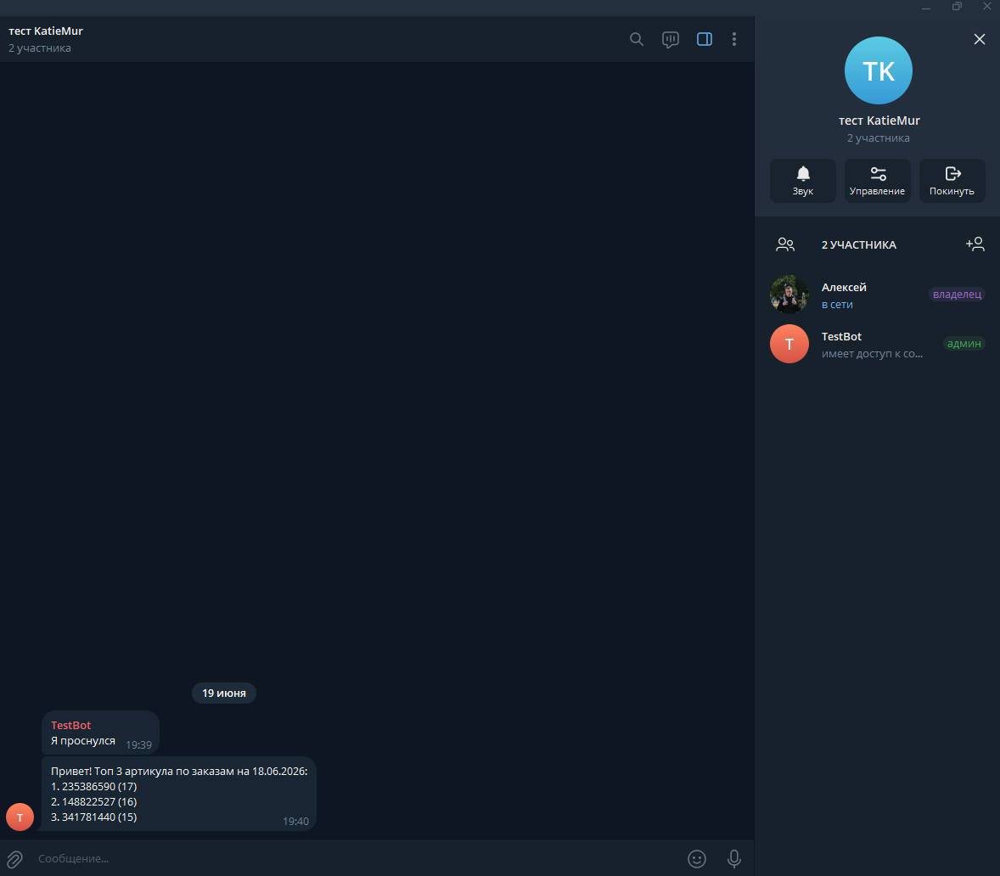

# Тестовое задание

## Структура проекта

- bot - реализация Telegram-бота
- service - вспомогательные модули для работы программы
    - calculate - функции для расчетов
    - csv_writer - функции для записи в csv-файл
- api.py - модуль для запросов к API
- main.py - точка входа в программу
- models.py - модуль для описания моделей данных
- settings.py - модуль для чтения переменных окружения

## Используемые компоненты

- Aiogram - реализация бота
- APScheduler - библиотека для планирования выполнения кода

## Требования к переменным окружения

- ACCESS_TOKEN - токен доступа к APi
- BOT_TOKEN - токен доступа к Telegram-боту
- CHAT_ID - идентификатор Telegram-чата в который идет рассылка

## Функционал

Структура сообщения бота:

Привет! Топ 3 артикула по заказам на [вчерашняя дата]n\

1. [артикул 1] (кол-во заказов)\n
2. [артикул 2] (кол-во заказов)\n
3. [артикул 3] (кол-во заказов)



## Запуск

1. клонирование репозитория

```commandline
git clone https://github.com/TwentyOn/KatieMur_task.git && cd KatieMur_task
```

2. сборка образа
```commandline
docker build -t test_task .
```

3. запуск контейнера
```commandline
docker run --env-file=<ИМЯ ФАЙЛА С ПЕРЕМЕННЫМИ ОКРЖЕНИЯ> --rm test_task
```

4. остановка контейнера
нажать сочетание клавиш: CTRL + C
